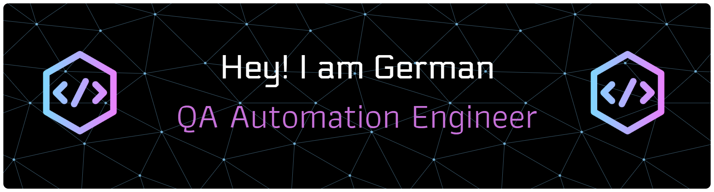

<!---
- 👋 Hi, I’m @qa-gvazquez from Veracruz, Mexico.
- 👀 I’m interested in Automation: Home, Industrial, or Software Automation.
- 🌱 I’m currently learning BDD with Cucumber, and CI/CD on Jenkins.
- 💞️ I’m looking to collaborate on Automation Frameworks on Selenium with Java, Python, or JavaScript.
- 📫 How to reach me [LinkedIN](https://www.linkedin.com/in/german-mx/)
- 😄 Pronouns: He/Him
- ⚡ Fun fact: I'm an Electronics Engineer, I switched career to 'Software Quality Assurance Testing' thanks to my Wife.

qa-gvazquez/qa-gvazquez is a ✨ special ✨ repository because its `README.md` (this file) appears on your GitHub profile.
You can click the Preview link to take a look at your changes.
--->

---

### About Me

- :telescope: I'm currently working on building an end-to-end automation framework using **Java, Selenium WebDriver, and RestAssured.**
- :seedling: I'm currently learning **JENKINS** and **Cucumber** to improve my CI/CD pipeline configuration skills.
- :dancers: I'm looking to collaborate on open-source QA projects or automation tools for testers transitioning from manual to automated testing.
- :speech_balloon: Ask me about **Selenium, JAVA, API Testing, or how to get started in QA Automation.**
- :mailbox: How to reach me: [german.avc@gmail.com](mailto:german.avc@gmail.com)
- 🪄 Let's connect on: [LinkedIN](https://www.linkedin.com/in/german-mx/)
- :zap: Fun fact: I take my coffee as seriously as I take my test reports :coffee::bar_chart: — freshly brewed and always consistent.

---

### TECH STACK:
 

<!-- Java -->

<!-- VS Code -->

<!-- IntelliJ -->

<!-- Github -->

<!-- Jenkins -->

  
  
  
  
  

---

### :package: Featured Projects

:small_blue_diamond: [Java for QA Testers](https://github.com/mx-gvazquez/JavaForTesters)  

---

### :fire: Most Used Languages

  

---
<!--
### 🏅 Certifications

| Certification        | Link                           | Issued Date |
|:-----------------------|:--------------------------------|:-------------|
| ISTQB® Advanced Level Test Automation Engineering |  [Official U.S. List of Certified & Credentialed Software Testers™ Profile](https://atsqa.org/certified-testers/profile/11ec543280ca4e3b81192d14304a726a) | Dec 2022    |

-->

### :chart_with_upwards_trend: GitHub Stats

   

---

### :brain: Quote that inspires me (Frase que me inspira)

> "If you get 1% better each day for one year, you'll end up 37 times better by the time you're done."  
> — *James Clear, Atomic Habits*
